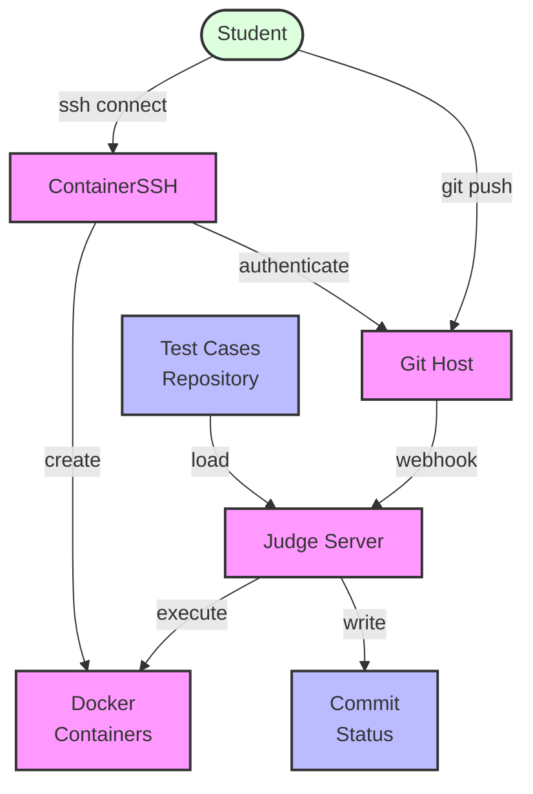

# System Architecture

```
                   ┌─────────────┐
                   │   Gitea     │
                   │  (Git Host) │
                   └─────┬───────┘
                         │ webhook
                         ▼
┌──────────────┐   ┌─────────────┐   ┌─────────────┐
│  Test Cases  │   │   Judge     │   │   Docker    │
│  Repository  │──▶│   Server    │──▶│  Containers │
└──────────────┘   └─────────────┘   └─────────────┘
                         │
                         │ results
                         ▼
                   ┌─────────────┐
                   │  Commit     │
                   │  Comments   │
                   └─────────────┘
```

## Overview

The GitCodeJudge system consists of multiple components working together to provide a secure and scalable automated
testing environment. In this example students uses ContainerSSH to connect to a development container to work on their code.
When they are ready to submit their code, they push it to a Git server. The Git server instance triggers a webhook to the Judge server.

## Components Diagram


